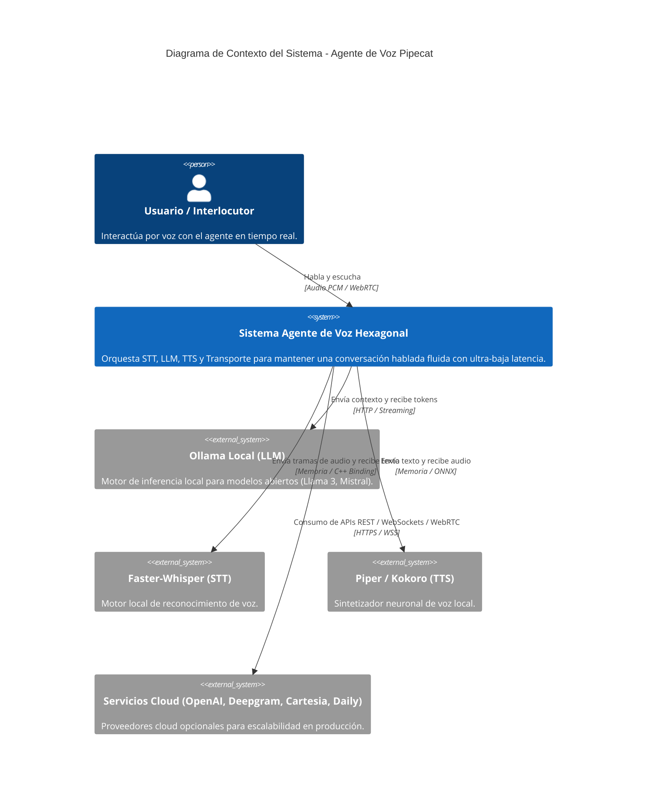
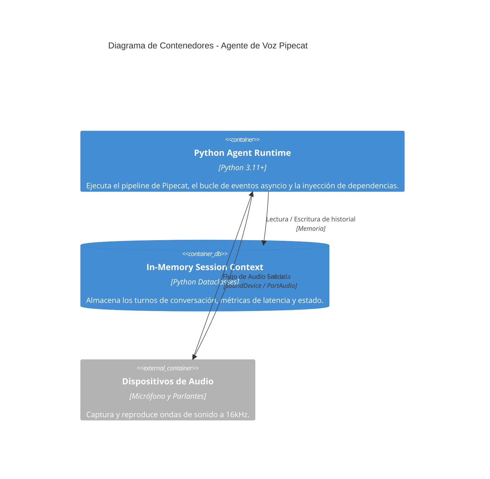
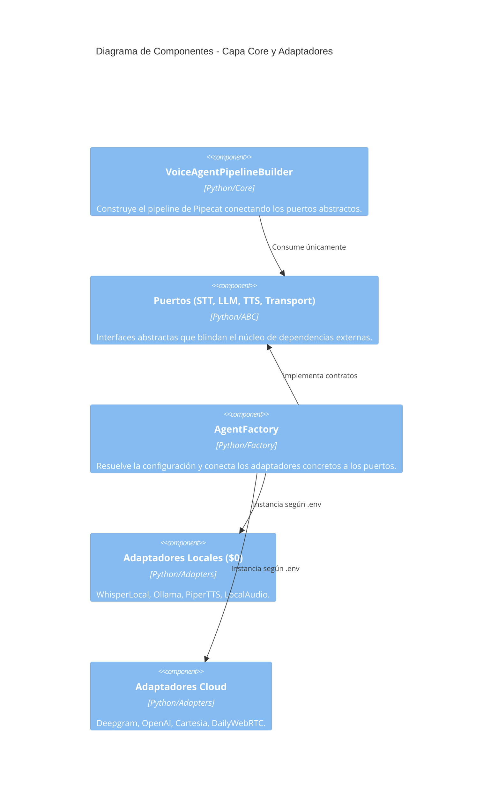

# 🏛️ Modelo C4: Arquitectura del Sistema de Agente de Voz

Este documento detalla la arquitectura del agente de voz en los niveles de **Contexto**, **Contenedor** y **Componente** según el modelo C4.

---

## Nivel 1: Diagrama de Contexto del Sistema

---

## Nivel 2: Diagrama de Contenedores

---

## Nivel 3: Diagrama de Componentes (Hexagonal)

