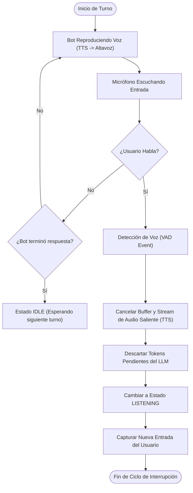

# 📊 Diagrama de Actividad: ACT-001 - Manejo de Interrupciones (Barge-in)

```mermaid
flowchart TD
    Start(["Inicio de Turno"]) --> BotSpeaking["Bot Reproduciendo Voz (TTS -> Altavoz)"]
    BotSpeaking --> MicListening["Micrófono Escuchando Entrada"]
    
    MicListening --> UserSpeaks{"¿Usuario Habla?"}
    UserSpeaks -- No --> BotFinished{"¿Bot terminó respuesta?"}
    BotFinished -- No --> BotSpeaking
    BotFinished -- Sí --> IdleState["Estado IDLE (Esperando siguiente turno)"]
    
    UserSpeaks -- Sí --> DetectVAD["Detección de Voz (VAD Event)"]
    DetectVAD --> CancelAudioStream["Cancelar Buffer y Stream de Audio Saliente (TTS)"]
    CancelAudioStream --> DiscardPendingTokens["Descartar Tokens Pendientes del LLM"]
    DiscardPendingTokens --> SwitchToListen["Cambiar a Estado LISTENING"]
    SwitchToListen --> CaptureNewTurn["Capturar Nueva Entrada del Usuario"]
    CaptureNewTurn --> End(["Fin de Ciclo de Interrupción"])
```
