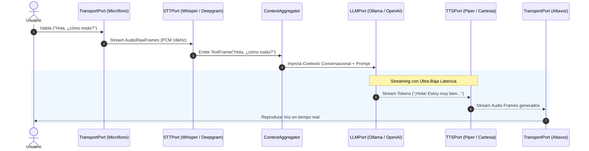

# 📊 Diagrama de Secuencia: SEQ-001 - Flujo Streaming del Pipeline de Voz

```mermaid
sequenceDiagram
    autonumber
    actor Usuario
    participant Transport as TransportPort (Micrófono)
    participant STT as STTPort (Whisper / Deepgram)
    participant Agg as ContextAggregator
    participant LLM as LLMPort (Ollama / OpenAI)
    participant TTS as TTSPort (Piper / Cartesia)
    participant Output as TransportPort (Altavoz)

    Usuario->>Transport: Habla ("Hola, ¿cómo estás?")
    Transport->>STT: Stream AudioRawFrames (PCM 16kHz)
    STT->>Agg: Emite TextFrame("Hola, ¿cómo estás?")
    Agg->>LLM: Inyecta Contexto Conversacional + Prompt
    
    rect rgb(240, 248, 255)
        note over LLM,TTS: Streaming con Ultra-Baja Latencia
        LLM-->>TTS: Stream Tokens ("¡Hola! Estoy muy bien...")
        TTS-->>Output: Stream Audio Frames generados
        Output-->>Usuario: Reproduce Voz en tiempo real
    end
```
