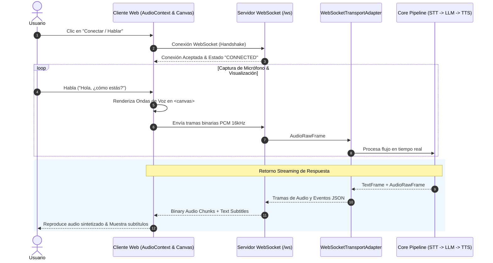

# 📊 Diagrama de Secuencia: SEQ-002 - Streaming de Audio Bidireccional por WebSocket

```mermaid
sequenceDiagram
    autonumber
    actor Usuario
    participant Browser as Cliente Web (AudioContext & Canvas)
    participant WS as Servidor WebSocket (/ws)
    participant Transport as WebSocketTransportAdapter
    participant Pipeline as Core Pipeline (STT -> LLM -> TTS)

    Usuario->>Browser: Clic en "Conectar / Hablar"
    Browser->>WS: Conexión WebSocket (Handshake)
    WS-->>Browser: Conexión Aceptada & Estado "CONNECTED"
    
    loop Captura de Micrófono & Visualización
        Usuario->>Browser: Habla ("Hola, ¿cómo estás?")
        Browser->>Browser: Renderiza Ondas de Voz en <canvas>
        Browser->>WS: Envía tramas binarias PCM 16kHz
        WS->>Transport: AudioRawFrame
        Transport->>Pipeline: Procesa flujo en tiempo real
    end
    
    rect rgb(240, 248, 255)
        note over Pipeline,Browser: Retorno Streaming de Respuesta
        Pipeline-->>Transport: TextFrame + AudioRawFrame
        Transport-->>WS: Tramas de Audio y Eventos JSON
        WS-->>Browser: Binary Audio Chunks + Text Subtitles
        Browser-->>Usuario: Reproduce audio sintetizado & Muestra subtítulos
    end
```
