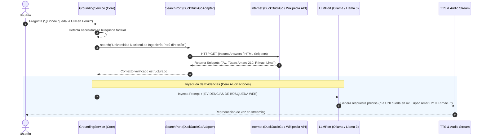

# 📊 Diagrama de Secuencia: SEQ-003 - Invocación de Herramienta de Búsqueda Web (Grounding)

```mermaid
sequenceDiagram
    autonumber
    actor Usuario
    participant Core as GroundingService (Core)
    participant Search as SearchPort (DuckDuckGoAdapter)
    participant Web as Internet (DuckDuckGo / Wikipedia API)
    participant LLM as LLMPort (Ollama / Llama 3)
    participant Output as TTS & Audio Stream

    Usuario->>Core: Pregunta ("¿Dónde queda la UNI en Perú?")
    Core->>Core: Detecta necesidad de búsqueda factual
    Core->>Search: search("Universidad Nacional de Ingeniería Perú dirección")
    Search->>Web: HTTP GET (Instant Answers / HTML Snippets)
    Web-->>Search: Retorna Snippets ("Av. Túpac Amaru 210, Rímac, Lima")
    Search-->>Core: Contexto verificado estructurado
    
    rect rgb(240, 248, 255)
        note over Core,LLM: Inyección de Evidencias (Cero Alucinaciones)
        Core->>LLM: Inyecta Prompt + [EVIDENCIAS DE BÚSQUEDA WEB]
        LLM-->>Output: Genera respuesta precisa ("La UNI queda en Av. Túpac Amaru 210, Rímac...")
        Output-->>Usuario: Reproducción de voz en streaming
    end
```
