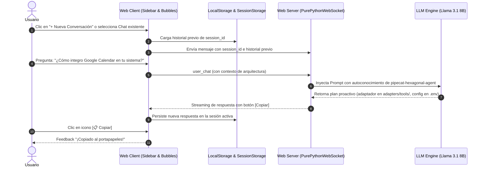

# 📊 Diagrama de Secuencia: SEQ-004 - Reanudación de Sesiones y Scaffolding Proactivo de MCP

```mermaid
sequenceDiagram
    autonumber
    actor Usuario
    participant UI as Web Client (Sidebar & Bubbles)
    participant Storage as LocalStorage & SessionStorage
    participant Server as Web Server (PurePythonWebSocket)
    participant LLM as LLM Engine (Llama 3.1 8B)

    Usuario->>UI: Clic en "+ Nueva Conversación" o selecciona Chat existente
    UI->>Storage: Carga historial previo de session_id
    UI->>Server: Envía mensaje con session_id e historial previo
    
    Usuario->>UI: Pregunta: "¿Cómo integro Google Calendar en tu sistema?"
    UI->>Server: user_chat (con contexto de arquitectura)
    Server->>LLM: Inyecta Prompt con autoconocimiento de pipecat-hexagonal-agent
    LLM-->>Server: Retorna plan proactivo (adaptador en adapters/tools/, config en .env)
    Server-->>UI: Streaming de respuesta con botón [Copiar]
    UI->>Storage: Persiste nueva respuesta en la sesión activa
    Usuario->>UI: Clic en icono [📋 Copiar]
    UI-->>Usuario: Feedback "¡Copiado al portapapeles!"
```
