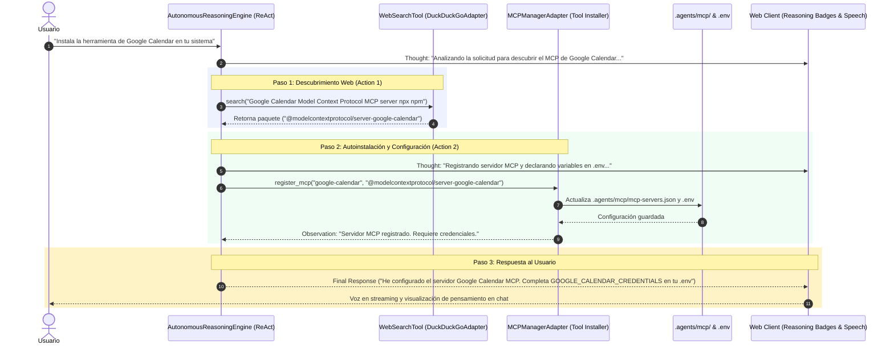

# 📊 Diagrama de Secuencia: SEQ-005 - Ciclo de Razonamiento ReAct y Autoinstalación de Servidores MCP

```mermaid
sequenceDiagram
    autonumber
    actor Usuario
    participant Core as AutonomousReasoningEngine (ReAct)
    participant Search as WebSearchTool (DuckDuckGoAdapter)
    participant MCPMgr as MCPManagerAdapter (Tool Installer)
    participant Storage as .agents/mcp/ & .env
    participant UI as Web Client (Reasoning Badges & Speech)

    Usuario->>Core: "Instala la herramienta de Google Calendar en tu sistema"
    Core->>UI: Thought: "Analizando la solicitud para descubrir el MCP de Google Calendar..."
    
    rect rgb(238, 242, 255)
        note over Core,Search: Paso 1: Descubrimiento Web (Action 1)
        Core->>Search: search("Google Calendar Model Context Protocol MCP server npx npm")
        Search-->>Core: Retorna paquete ("@modelcontextprotocol/server-google-calendar")
    end

    rect rgb(240, 253, 244)
        note over Core,MCPMgr: Paso 2: Autoinstalación y Configuración (Action 2)
        Core->>UI: Thought: "Registrando servidor MCP y declarando variables en .env..."
        Core->>MCPMgr: register_mcp("google-calendar", "@modelcontextprotocol/server-google-calendar")
        MCPMgr->>Storage: Actualiza .agents/mcp/mcp-servers.json y .env
        Storage-->>MCPMgr: Configuración guardada
        MCPMgr-->>Core: Observation: "Servidor MCP registrado. Requiere credenciales."
    end

    rect rgb(254, 243, 199)
        note over Core,UI: Paso 3: Respuesta al Usuario
        Core-->>UI: Final Response ("He configurado el servidor Google Calendar MCP. Completa GOOGLE_CALENDAR_CREDENTIALS en tu .env")
        UI-->>Usuario: Voz en streaming y visualización de pensamiento en chat
    end
```
