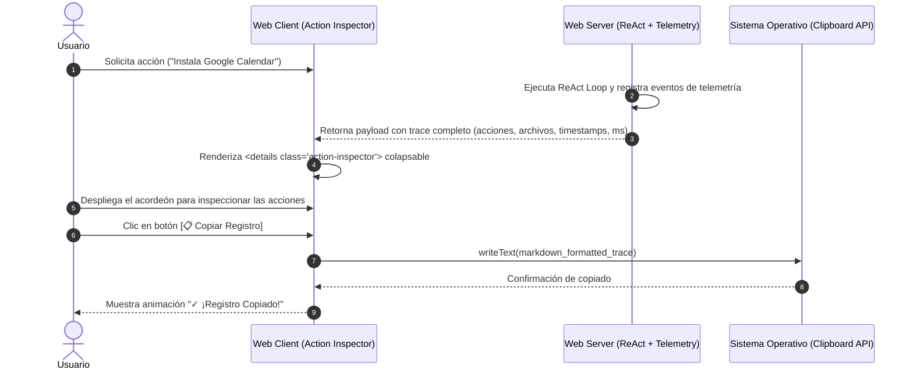

# 📊 Diagrama de Secuencia: SEQ-006 - Streaming de Acciones y Exportación al Portapapeles

```mermaid
sequenceDiagram
    autonumber
    actor Usuario
    participant UI as Web Client (Action Inspector)
    participant Server as Web Server (ReAct + Telemetry)
    participant Clipboard as Sistema Operativo (Clipboard API)

    Usuario->>UI: Solicita acción ("Instala Google Calendar")
    Server->>Server: Ejecuta ReAct Loop y registra eventos de telemetría
    Server-->>UI: Retorna payload con trace completo (acciones, archivos, timestamps, ms)
    UI->>UI: Renderiza <details class="action-inspector"> colapsable
    Usuario->>UI: Despliega el acordeón para inspeccionar las acciones
    Usuario->>UI: Clic en botón [📋 Copiar Registro]
    UI->>Clipboard: writeText(markdown_formatted_trace)
    Clipboard-->>UI: Confirmación de copiado
    UI-->>Usuario: Muestra animación "✓ ¡Registro Copiado!"
```
