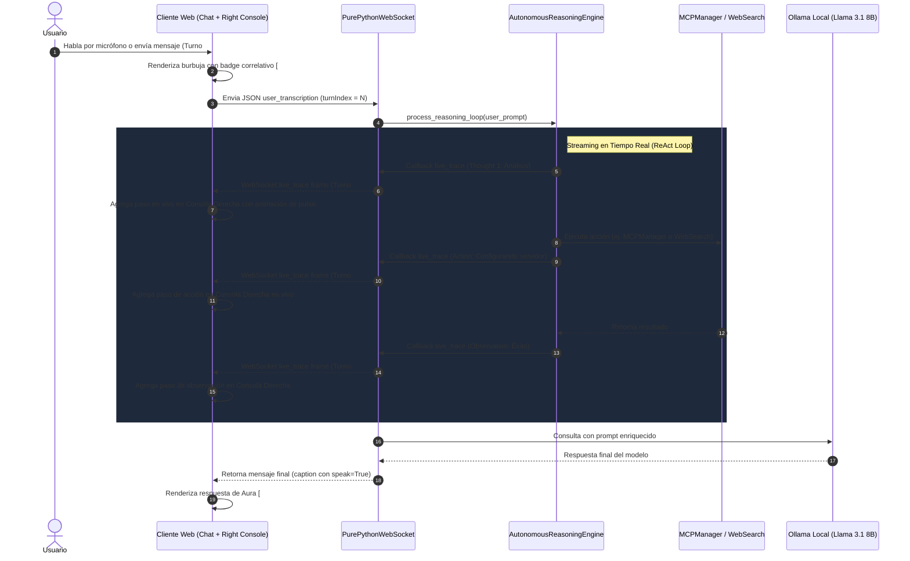

# 📊 Diagrama de Secuencia: SEQ-007 - Streaming de Trazabilidad en Tiempo Real a Consola Lateral

```mermaid
sequenceDiagram
    autonumber
    actor Usuario
    participant UI as Cliente Web (Chat + Right Console)
    participant WS as PurePythonWebSocket
    participant ReAct as AutonomousReasoningEngine
    participant Tool as MCPManager / WebSearch
    participant LLM as Ollama Local (Llama 3.1 8B)

    Usuario->>UI: Habla por micrófono o envía mensaje (Turno #N)
    UI->>UI: Renderiza burbuja con badge correlativo [#N]
    UI->>WS: Envia JSON user_transcription (turnIndex = N)
    
    WS->>ReAct: process_reasoning_loop(user_prompt)
    
    rect rgb(30, 41, 59)
    note right of ReAct: Streaming en Tiempo Real (ReAct Loop)
    ReAct->>WS: Callback live_trace (Thought 1: Análisis)
    WS-->>UI: WebSocket live_trace frame (Turno #N)
    UI->>UI: Agrega paso en vivo en Consola Derecha con animación de pulso
    
    ReAct->>Tool: Ejecuta acción (ej. MCPManager o WebSearch)
    ReAct->>WS: Callback live_trace (Action: Configurando servidor)
    WS-->>UI: WebSocket live_trace frame (Turno #N)
    UI->>UI: Agrega paso de acción en Consola Derecha en vivo
    
    Tool-->>ReAct: Retorna resultado
    ReAct->>WS: Callback live_trace (Observation: Éxito)
    WS-->>UI: WebSocket live_trace frame (Turno #N)
    UI->>UI: Agrega paso de observación en Consola Derecha
    end

    WS->>LLM: Consulta con prompt enriquecido
    LLM-->>WS: Respuesta final del modelo
    WS-->>UI: Retorna mensaje final (caption con speak=True)
    UI->>UI: Renderiza respuesta de Aura [#N+1] y finaliza spinner de Turno #N en la consola
```
