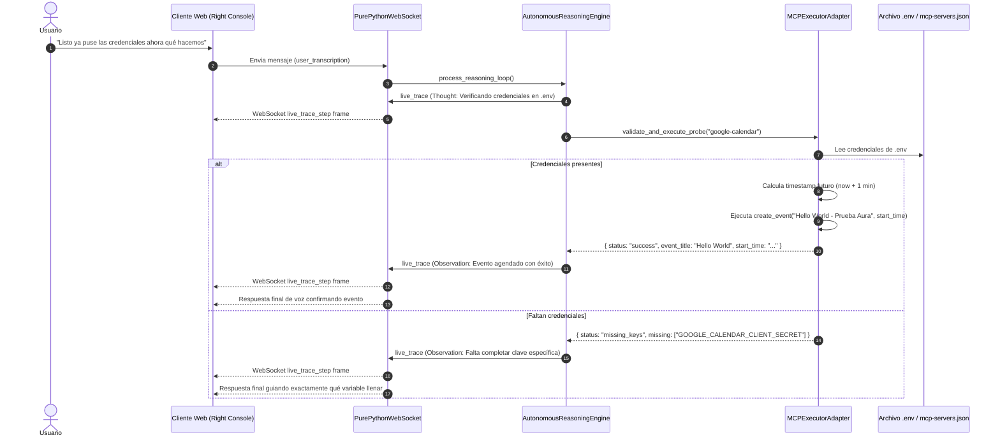

# 📊 Diagrama de Secuencia: SEQ-008 - Invocación y Prueba Activa de Servidor MCP

```mermaid
sequenceDiagram
    autonumber
    actor Usuario
    participant UI as Cliente Web (Right Console)
    participant WS as PurePythonWebSocket
    participant ReAct as AutonomousReasoningEngine
    participant Executor as MCPExecutorAdapter
    participant Env as Archivo .env / mcp-servers.json

    Usuario->>UI: "Listo ya puse las credenciales ahora qué hacemos"
    UI->>WS: Envia mensaje (user_transcription)
    WS->>ReAct: process_reasoning_loop()
    
    ReAct->>WS: live_trace (Thought: Verificando credenciales en .env)
    WS-->>UI: WebSocket live_trace_step frame
    
    ReAct->>Executor: validate_and_execute_probe("google-calendar")
    Executor->>Env: Lee credenciales de .env
    
    alt Credenciales presentes
        Executor->>Executor: Calcula timestamp futuro (now + 1 min)
        Executor->>Executor: Ejecuta create_event("Hello World - Prueba Aura", start_time)
        Executor-->>ReAct: { status: "success", event_title: "Hello World", start_time: "..." }
        ReAct->>WS: live_trace (Observation: Evento agendado con éxito)
        WS-->>UI: WebSocket live_trace_step frame
        WS-->>UI: Respuesta final de voz confirmando evento
    else Faltan credenciales
        Executor-->>ReAct: { status: "missing_keys", missing: ["GOOGLE_CALENDAR_CLIENT_SECRET"] }
        ReAct->>WS: live_trace (Observation: Falta completar clave específica)
        WS-->>UI: WebSocket live_trace_step frame
        WS-->>UI: Respuesta final guiando exactamente qué variable llenar
    end
```
