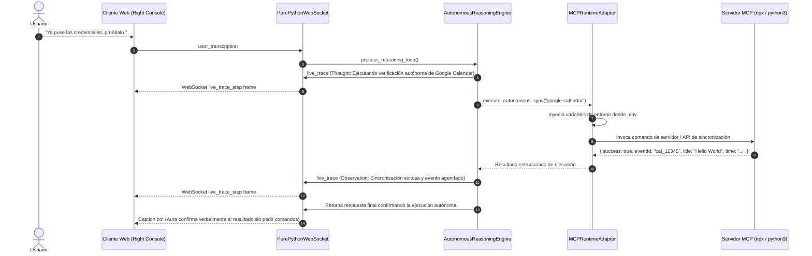

# 📊 Diagrama de Secuencia: SEQ-009 - Ejecución Autónoma de Herramientas MCP en Subproceso

```mermaid
sequenceDiagram
    autonumber
    actor Usuario
    participant UI as Cliente Web (Right Console)
    participant WS as PurePythonWebSocket
    participant ReAct as AutonomousReasoningEngine
    participant Runtime as MCPRuntimeAdapter
    participant ServerMCP as Servidor MCP (npx / python3)

    Usuario->>UI: "Ya puse las credenciales, pruébalo."
    UI->>WS: user_transcription
    WS->>ReAct: process_reasoning_loop()
    
    ReAct->>WS: live_trace (Thought: Ejecutando verificación autónoma de Google Calendar)
    WS-->>UI: WebSocket live_trace_step frame
    
    ReAct->>Runtime: execute_autonomous_sync("google-calendar")
    Runtime->>Runtime: Inyecta variables de entorno desde .env
    Runtime->>ServerMCP: Invoca comando de servidor / API de sincronización
    ServerMCP-->>Runtime: { success: true, eventId: "cal_12345", title: "Hello World", time: "..." }
    
    Runtime-->>ReAct: Resultado estructurado de ejecución
    ReAct->>WS: live_trace (Observation: Sincronización exitosa y evento agendado)
    WS-->>UI: WebSocket live_trace_step frame
    
    ReAct->>WS: Retorna respuesta final confirmando la ejecución autónoma
    WS-->>UI: Caption bot (Aura confirma verbalmente el resultado sin pedir comandos)
```
