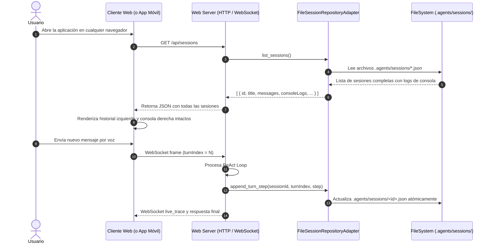

# 📊 Diagrama de Secuencia: SEQ-010 - Sincronización y Persistencia de Sesiones en Backend

```mermaid
sequenceDiagram
    autonumber
    actor Usuario
    participant UI as Cliente Web (o App Móvil)
    participant Server as Web Server (HTTP / WebSocket)
    participant Repo as FileSessionRepositoryAdapter
    participant FS as FileSystem (.agents/sessions/)

    Usuario->>UI: Abre la aplicación en cualquier navegador
    UI->>Server: GET /api/sessions
    Server->>Repo: list_sessions()
    Repo->>FS: Lee archivos .agents/sessions/*.json
    FS-->>Repo: Lista de sesiones completas con logs de consola
    Repo-->>Server: [ { id, title, messages, consoleLogs, ... } ]
    Server-->>UI: Retorna JSON con todas las sesiones
    UI->>UI: Renderiza historial izquierdo y consola derecha intactos

    Usuario->>UI: Envía nuevo mensaje por voz
    UI->>Server: WebSocket frame (turnIndex = N)
    Server->>Server: Procesa ReAct Loop
    Server->>Repo: append_turn_step(sessionId, turnIndex, step)
    Repo->>FS: Actualiza .agents/sessions/<id>.json atómicamente
    Server-->>UI: WebSocket live_trace y respuesta final
```
