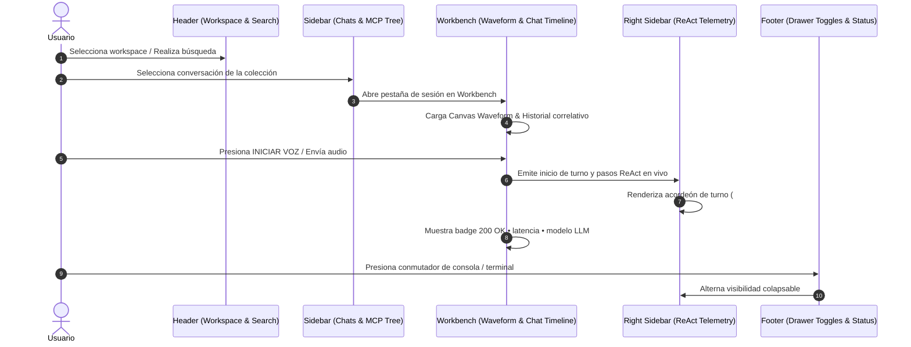

# 📊 Diagrama de Secuencia: SEQ-011 - Interacción y Flujo en el Layout Postman/IDE Workbench

```mermaid
sequenceDiagram
    autonumber
    actor Usuario
    participant Header as Header (Workspace & Search)
    participant Sidebar as Sidebar (Chats & MCP Tree)
    participant Workbench as Workbench (Waveform & Chat Timeline)
    participant RightConsole as Right Sidebar (ReAct Telemetry)
    participant Footer as Footer (Drawer Toggles & Status)

    Usuario->>Header: Selecciona workspace / Realiza búsqueda
    Usuario->>Sidebar: Selecciona conversación de la colección
    Sidebar->>Workbench: Abre pestaña de sesión en Workbench
    Workbench->>Workbench: Carga Canvas Waveform & Historial correlativo

    Usuario->>Workbench: Presiona INICIAR VOZ / Envía audio
    Workbench->>RightConsole: Emite inicio de turno y pasos ReAct en vivo
    RightConsole->>RightConsole: Renderiza acordeón de turno (#1, #2...) con pasos
    Workbench->>Workbench: Muestra badge 200 OK • latencia • modelo LLM

    Usuario->>Footer: Presiona conmutador de consola / terminal
    Footer->>RightConsole: Alterna visibilidad colapsable
```
