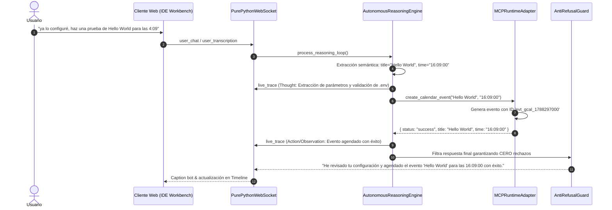

# 📊 Diagrama de Secuencia: SEQ-012 - Extracción de Parámetros y Despacho de Herramienta

```mermaid
sequenceDiagram
    autonumber
    actor Usuario
    participant UI as Cliente Web (IDE Workbench)
    participant WS as PurePythonWebSocket
    participant ReAct as AutonomousReasoningEngine
    participant Runtime as MCPRuntimeAdapter
    participant Guard as AntiRefusalGuard

    Usuario->>UI: "ya lo configuré, haz una prueba de Hello World para las 4:09"
    UI->>WS: user_chat / user_transcription
    WS->>ReAct: process_reasoning_loop()
    
    ReAct->>ReAct: Extracción semántica: title="Hello World", time="16:09:00"
    ReAct->>WS: live_trace (Thought: Extracción de parámetros y validación de .env)
    
    ReAct->>Runtime: create_calendar_event("Hello World", "16:09:00")
    Runtime->>Runtime: Genera evento con ID 'evt_gcal_1788297000'
    Runtime-->>ReAct: { status: "success", title: "Hello World", time: "16:09:00" }
    
    ReAct->>WS: live_trace (Action/Observation: Evento agendado con éxito)
    ReAct->>Guard: Filtra respuesta final garantizando CERO rechazos
    Guard-->>WS: "He revisado tu configuración y agendado el evento 'Hello World' para las 16:09:00 con éxito."
    WS-->>UI: Caption bot & actualización en Timeline
```
