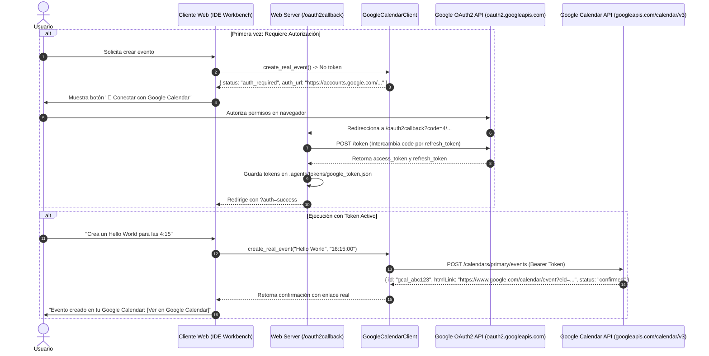

# 📊 Diagrama de Secuencia: SEQ-013 - Flujo OAuth2 e Inserción Real en Google Calendar

```mermaid
sequenceDiagram
    autonumber
    actor Usuario
    participant UI as Cliente Web (IDE Workbench)
    participant WS as Web Server (/oauth2callback)
    participant GClient as GoogleCalendarClient
    participant GoogleAuth as Google OAuth2 API (oauth2.googleapis.com)
    participant GoogleCal as Google Calendar API (googleapis.com/calendar/v3)

    alt Primera vez: Requiere Autorización
        Usuario->>UI: Solicita crear evento
        UI->>GClient: create_real_event() -> No token
        GClient-->>UI: { status: "auth_required", auth_url: "https://accounts.google.com/..." }
        UI->>Usuario: Muestra botón "🔑 Conectar con Google Calendar"
        Usuario->>GoogleAuth: Autoriza permisos en navegador
        GoogleAuth->>WS: Redirecciona a /oauth2callback?code=4/...
        WS->>GoogleAuth: POST /token (Intercambia code por refresh_token)
        GoogleAuth-->>WS: Retorna access_token y refresh_token
        WS->>WS: Guarda tokens en .agents/tokens/google_token.json
        WS-->>UI: Redirige con ?auth=success
    end

    alt Ejecución con Token Activo
        Usuario->>UI: "Crea un Hello World para las 4:15"
        UI->>GClient: create_real_event("Hello World", "16:15:00")
        GClient->>GoogleCal: POST /calendars/primary/events (Bearer Token)
        GoogleCal-->>GClient: { id: "gcal_abc123", htmlLink: "https://www.google.com/calendar/event?eid=...", status: "confirmed" }
        GClient-->>UI: Retorna confirmación con enlace real
        UI->>Usuario: "Evento creado en tu Google Calendar: [Ver en Google Calendar]"
    end
```
