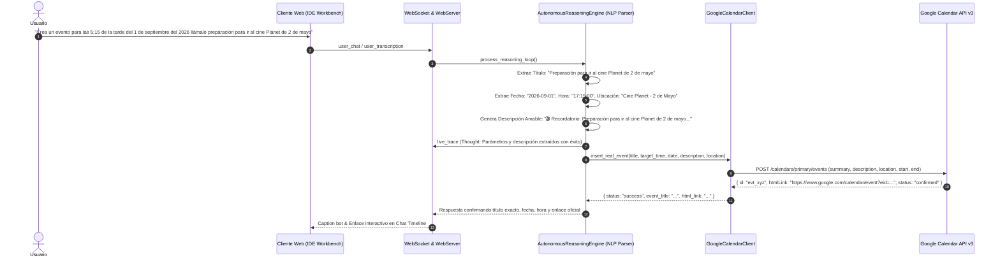

# 📊 Diagrama de Secuencia: SEQ-014 - Extracción NLP e Inserción de Evento Enriquecido

```mermaid
sequenceDiagram
    autonumber
    actor Usuario
    participant UI as Cliente Web (IDE Workbench)
    participant WS as WebSocket & WebServer
    participant NLP as AutonomousReasoningEngine (NLP Parser)
    participant GClient as GoogleCalendarClient
    participant GCalAPI as Google Calendar API v3

    Usuario->>UI: "Crea un evento para las 5:15 de la tarde del 1 de septiembre del 2026 llámalo preparación para ir al cine Planet de 2 de mayo"
    UI->>WS: user_chat / user_transcription
    WS->>NLP: process_reasoning_loop()
    
    NLP->>NLP: Extrae Título: "Preparación para ir al cine Planet de 2 de mayo"
    NLP->>NLP: Extrae Fecha: "2026-09-01", Hora: "17:15:00", Ubicación: "Cine Planet - 2 de Mayo"
    NLP->>NLP: Genera Descripción Amable: "🎬 Recordatorio: Preparación para ir al cine Planet de 2 de mayo..."
    
    NLP->>WS: live_trace (Thought: Parámetros y descripción extraídos con éxito)
    NLP->>GClient: insert_real_event(title, target_time, date, description, location)
    
    GClient->>GCalAPI: POST /calendars/primary/events (summary, description, location, start, end)
    GCalAPI-->>GClient: { id: "evt_xyz", htmlLink: "https://www.google.com/calendar/event?eid=...", status: "confirmed" }
    
    GClient-->>NLP: { status: "success", event_title: "...", html_link: "..." }
    NLP-->>WS: Respuesta confirmando título exacto, fecha, hora y enlace oficial
    WS-->>UI: Caption bot & Enlace interactivo en Chat Timeline
```
