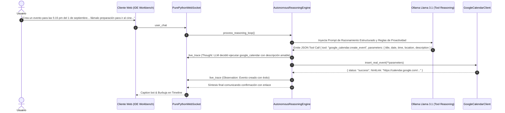

# 📊 Diagrama de Secuencia: SEQ-015 - Despacho de Herramientas Guiado por el LLM

```mermaid
sequenceDiagram
    autonumber
    actor Usuario
    participant UI as Cliente Web (IDE Workbench)
    participant WS as PurePythonWebSocket
    participant ReAct as AutonomousReasoningEngine
    participant LLM as Ollama Llama 3.1 (Tool Reasoning)
    participant GCal as GoogleCalendarClient

    Usuario->>UI: "Crea un evento para las 5:15 pm del 1 de septiembre... llámalo preparación para ir al cine..."
    UI->>WS: user_chat
    WS->>ReAct: process_reasoning_loop()
    
    ReAct->>LLM: Inyecta Prompt de Razonamiento Estructurado y Reglas de Proactividad
    LLM-->>ReAct: Emite JSON Tool Call { tool: "google_calendar.create_event", parameters: { title, date, time, location, description } }
    
    ReAct->>WS: live_trace (Thought: LLM decidió ejecutar google_calendar con descripción amable)
    ReAct->>GCal: insert_real_event(**parameters)
    GCal-->>ReAct: { status: "success", htmlLink: "https://calendar.google.com/..." }
    
    ReAct->>WS: live_trace (Observation: Evento creado con éxito)
    ReAct-->>WS: Síntesis final comunicando confirmación con enlace
    WS-->>UI: Caption bot & Burbuja en Timeline
```
