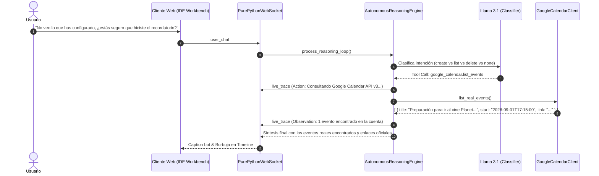

# 📊 Diagrama de Secuencia: SEQ-016 - Consulta de Calendario y Despacho Multi-Herramienta

```mermaid
sequenceDiagram
    autonumber
    actor Usuario
    participant UI as Cliente Web (IDE Workbench)
    participant WS as PurePythonWebSocket
    participant ReAct as AutonomousReasoningEngine
    participant LLM as Llama 3.1 (Classifier)
    participant GCal as GoogleCalendarClient

    Usuario->>UI: "No veo lo que has configurado, ¿estás seguro que hiciste el recordatorio?"
    UI->>WS: user_chat
    WS->>ReAct: process_reasoning_loop()
    
    ReAct->>LLM: Clasifica intención (create vs list vs delete vs none)
    LLM-->>ReAct: Tool Call: google_calendar.list_events
    
    ReAct->>WS: live_trace (Action: Consultando Google Calendar API v3...)
    ReAct->>GCal: list_real_events()
    GCal-->>ReAct: [ { title: "Preparación para ir al cine Planet...", start: "2026-09-01T17:15:00", link: "..." } ]
    
    ReAct->>WS: live_trace (Observation: 1 evento encontrado en la cuenta)
    ReAct-->>WS: Síntesis final con los eventos reales encontrados y enlaces oficiales
    WS-->>UI: Caption bot & Burbuja en Timeline
```
