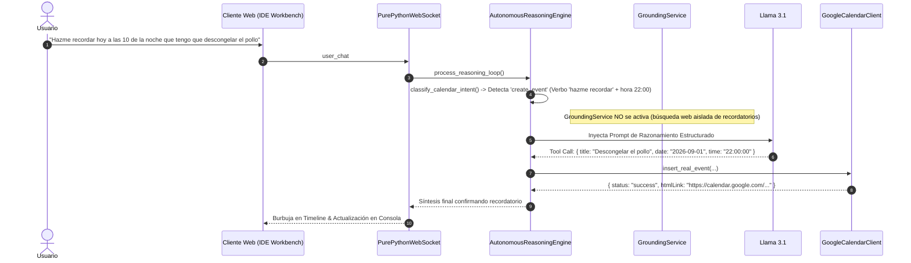

# 📊 Diagrama de Secuencia: SEQ-017 - Enrutamiento de Recordatorios y Aislamiento de Búsqueda Web

```mermaid
sequenceDiagram
    autonumber
    actor Usuario
    participant UI as Cliente Web (IDE Workbench)
    participant WS as PurePythonWebSocket
    participant ReAct as AutonomousReasoningEngine
    participant GService as GroundingService
    participant LLM as Llama 3.1
    participant GCal as GoogleCalendarClient

    Usuario->>UI: "Hazme recordar hoy a las 10 de la noche que tengo que descongelar el pollo"
    UI->>WS: user_chat
    WS->>ReAct: process_reasoning_loop()
    
    ReAct->>ReAct: classify_calendar_intent() -> Detecta 'create_event' (Verbo 'hazme recordar' + hora 22:00)
    Note over GService: GroundingService NO se activa (búsqueda web aislada de recordatorios)
    
    ReAct->>LLM: Inyecta Prompt de Razonamiento Estructurado
    LLM-->>ReAct: Tool Call: { title: "Descongelar el pollo", date: "2026-09-01", time: "22:00:00" }
    
    ReAct->>GCal: insert_real_event(...)
    GCal-->>ReAct: { status: "success", htmlLink: "https://calendar.google.com/..." }
    ReAct-->>WS: Síntesis final confirmando recordatorio
    WS-->>UI: Burbuja en Timeline & Actualización en Consola
```
