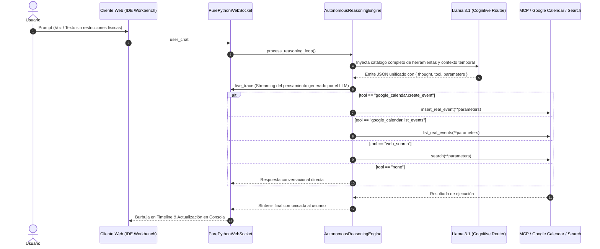

# 📊 Diagrama de Secuencia: SEQ-018 - Orquestación Cognitiva Unificada por el LLM

```mermaid
sequenceDiagram
    autonumber
    actor Usuario
    participant UI as Cliente Web (IDE Workbench)
    participant WS as PurePythonWebSocket
    participant ReAct as AutonomousReasoningEngine
    participant LLM as Llama 3.1 (Cognitive Router)
    participant Tool as MCP / Google Calendar / Search

    Usuario->>UI: Prompt (Voz / Texto sin restricciones léxicas)
    UI->>WS: user_chat
    WS->>ReAct: process_reasoning_loop()
    
    ReAct->>LLM: Inyecta catálogo completo de herramientas y contexto temporal
    LLM-->>ReAct: Emite JSON unificado con { thought, tool, parameters }
    
    ReAct->>WS: live_trace (Streaming del pensamiento generado por el LLM)
    
    alt tool == "google_calendar.create_event"
        ReAct->>Tool: insert_real_event(**parameters)
    else tool == "google_calendar.list_events"
        ReAct->>Tool: list_real_events(**parameters)
    else tool == "web_search"
        ReAct->>Tool: search(**parameters)
    else tool == "none"
        ReAct-->>WS: Respuesta conversacional directa
    end
    
    Tool-->>ReAct: Resultado de ejecución
    ReAct-->>WS: Síntesis final comunicada al usuario
    WS-->>UI: Burbuja en Timeline & Actualización en Consola
```
