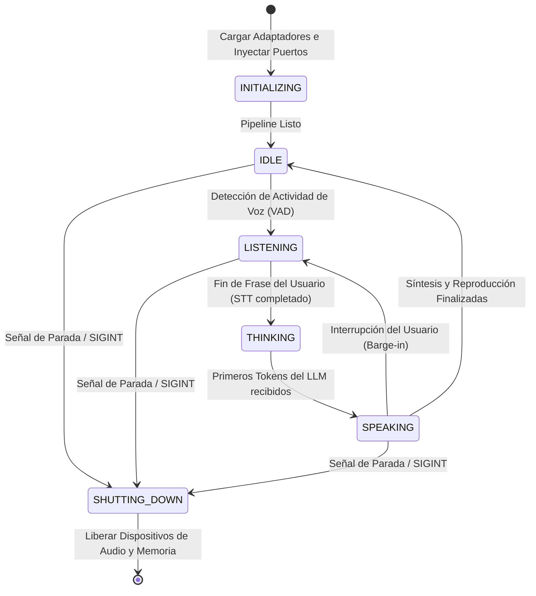

# 📊 Máquina de Estados: STM-001 - Ciclo de Vida del Agente de Voz

```mermaid
stateDiagram-v2
    [*] --> INITIALIZING: Cargar Adaptadores e Inyectar Puertos
    
    INITIALIZING --> IDLE: Pipeline Listo
    
    IDLE --> LISTENING: Detección de Actividad de Voz (VAD)
    
    LISTENING --> THINKING: Fin de Frase del Usuario (STT completado)
    
    THINKING --> SPEAKING: Primeros Tokens del LLM recibidos
    
    SPEAKING --> LISTENING: Interrupción del Usuario (Barge-in)
    
    SPEAKING --> IDLE: Síntesis y Reproducción Finalizadas
    
    IDLE --> SHUTTING_DOWN: Señal de Parada / SIGINT
    LISTENING --> SHUTTING_DOWN: Señal de Parada / SIGINT
    SPEAKING --> SHUTTING_DOWN: Señal de Parada / SIGINT
    
    SHUTTING_DOWN --> [*]: Liberar Dispositivos de Audio y Memoria
```
